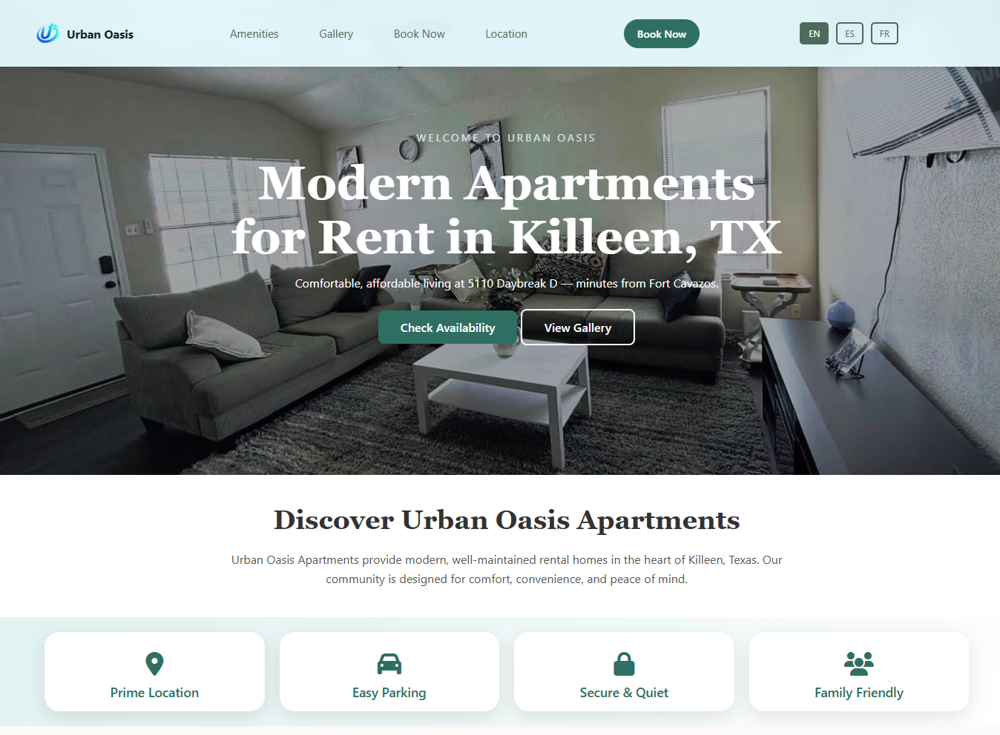
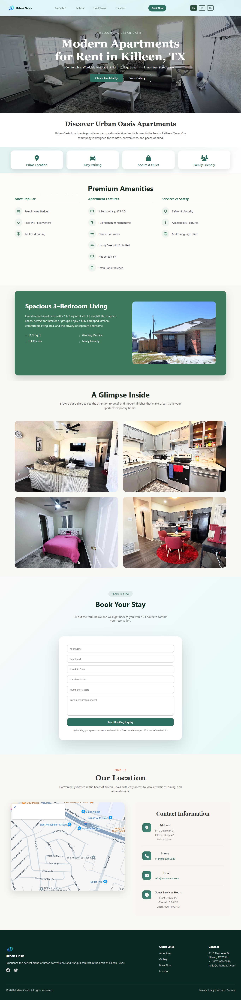

# Urban Oasis Apartment Website

 <!-- Replace with a screenshot of the home page -->

**Client Project:** Custom-built website for Urban Oasis Apartment.  
This website was designed and developed to showcase apartment listings, amenities, booking options, and property information in a modern, responsive, and user-friendly interface.

---

## 🏙️ Project Overview

Urban Oasis Apartment Website is a **responsive, static website** that provides:

- 🏠 **Home / Landing Page** – Highlighting featured apartments and services.
- 📸 **Gallery** – Display of apartment images and facilities.
- 🛏️ **Amenities Page** – Detailing apartment features and services.
- 📍 **Location & Contact Page** – Showing property location and contact details.
- 🧾 **Terms & Privacy Pages** – Important legal information.
- 📅 **Booking & Checkout Pages** – Simple user-friendly booking process.

**Purpose:** To establish a professional online presence for Urban Oasis Apartment, facilitate bookings, and attract potential tenants.

---

## 🎨 Features

- Fully **responsive design** for desktop, tablet, and mobile.
- Clean, modern **UI/UX** design.
- Interactive **image gallery** and booking forms.
- Easy-to-update content (text, images, amenities).
- Lightweight and optimized for fast performance.

---

## 📁 Project Structure
/
├── index.html # Landing/Home page
├── gallery.html # Gallery of apartments
├── amenities.html # Amenities and features
├── location.html # Location & contact information
├── booking.html # Booking form/page
├── checkout.html # Checkout page
├── terms.html # Terms & conditions
├── privacy.html # Privacy policy
├── style.css # Custom CSS styles
├── script.js # JavaScript functionality
├── images/ # Project images
└── .github/ # Optional GitHub config

---

## 🖥️ Live Preview

You can view the website live (if deployed) here:  
[Urban Oasis Apartment Demo](https://samtem08.github.io/urbanoasisapartment/)

**Screenshots:**  

  

---

📫 Contact / Maintainer

Samuel Adefowope – Website Developer

GitHub: @samtem08
Email: samuelaadefowope@gmail.com

 ⚠️ Client Delivery Note

This website is developed exclusively for Urban Oasis Apartment. Unauthorized copying, redistribution, or reuse without permission is prohibited.
